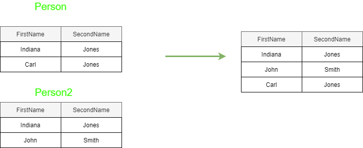
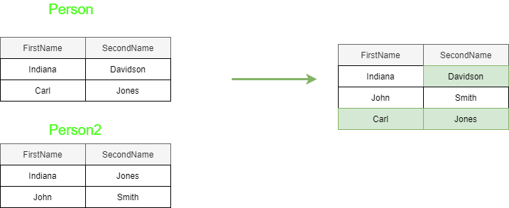

# Data Modification

The following sections show how to perform various aspects of data definition. We can run up a working SQL server instance on which contains a ScratchDb database by using the command 

```
docker-compose up --build
```

Once running connect to localhost from Microsoft SQL Server Management Studio using the login **sa** and the password **DatabasePassw0rd**

We can create the Person table in the ScratchDb database using the following data definiton command 

```sql
DROP TABLE IF EXISTS Person

CREATE TABLE Person2
(
    FirstName VARCHAR(32),
    SecondName VARCHAR(32)
)
```

## INSERT VALUES
### Example I 
Insert a single row into a table. As we provide no explicit value to column mapping, the mapping is based on the order of coumns in the create table expression.

```sql
INSERT INTO Person2
VALUES
('John', 'Smith')
```

### Example II 
We can optionally specify the columns which gives us control over which value maps to which column. This is generally better than using the order of columns in the create table expression.

```sql
INSERT INTO Person2
(
    FirstName,
    SecondName
)
VALUES
('Dave', 'Smith')

```
### Example III (T-SQL Non-standard extension)
Finally T-SQL provides a non-standard extension that enables us to specify multiple rows in a single statement, separated by commas. All the rows are treated as a transaction

```sql
INSERT INTO Person2
(
    FirstName,
    SecondName
)
VALUES
('Sam', 'Smith'),
('Jean', 'Smith')
```

## INSERT SELECT
### Example I 
Uses a select statement to insert data into a table. As we provide no explicit column mapping it is based on the order of columns in the two tables. 

```sql
insert into Person2
select *
from Person

```
### Example II
We can modify our statement to explicity map columns from source to target.

```sql
insert into Person2
(
    FirstName,
    SecondName
)
select FirstName,
       SecondName
from Person


```

### Example III
The following template can be used to insert data into a table only if it does not already exist.

```sql
INSERT Person2
(
    FirstName,
    SecondName
)
SELECT *
FROM Person
WHERE NOT EXISTS
(
    SELECT FirstName FROM Person2 WHERE Person2.FirstName = Person.FirstName
)
```



## INSERT EXEC
### Example I
Insert rows resulting from stored procedure call
```sql
CREATE PROC GetPeople
AS 
  SELECT * From Person
GO

INSERT INTO Person2
EXEC GetPeople

```

## SELECT INTO
Non-standard statement that creates a new table if it does not exist.

```sql
SELECT *
INTO dbo.Person2
FROM Person

```

## MERGE (Upsert)
We can use [Merge](https://docs.microsoft.com/en-us/sql/t-sql/statements/merge-transact-sql?view=sql-server-ver15) to runs insert, update, or delete operations on a target table from the results of a join with a source table. One typical use it to perform an **upsert**.

```sql
MERGE Person2 AS MyTarget
USING
(SELECT * FROM Person) AS MyChanges
ON MyTarget.FirstName = MyChanges.FirstName
WHEN MATCHED THEN
    UPDATE SET MyTarget.SecondName = MyChanges.SecondName
WHEN NOT MATCHED THEN
    INSERT
    (
        FirstName,
        SecondName
    )
    VALUES
    (MyChanges.FirstName, MyChanges.SecondName);
```



## SELECT FROM AS 
Creates a table on the fly
```sql
SELECT * 
FROM ( 
    VALUES 
	    (1, 1),
	    (2, 4)
    ) AS SQUARES (X, [X^2])

```